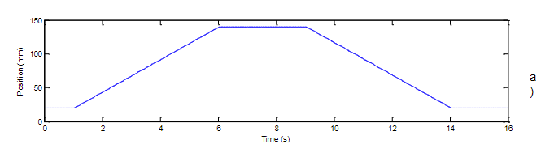

RAVEN: Romdon wAVelet KErNels

This is the repo of the paper [Random wavelet kernels for interpretable fault diagnosis in industrial systems](https://doi.org/10.1016/j.cirp.2025.04.083).

Time Series Classification inspired by Random Convolutional Kernel Transformation ([ROCKET](https://arxiv.org/abs/1910.13051)).

### Data
The data folder includes all the data used in this project. The `instances` and `inference` folders will be generated automatically after running the `data_processing.py` file.

- `raw`: the raw data for this project to start
- `instances`: the instances to enable the system to refer to and derive from. 
- `inference`: the samples for testing the inference capability of the system  

The raw data is original from the following link:

https://cord.cranfield.ac.uk/articles/dataset/Data_set_for_Data-based_Detection_and_Diagnosis_of_Faults_in_Linear_Actuators_/5097649

The original file is converted from .mat format into .csv format using the `file_converter.py`. It is recommended to directly use the .csv file as the beginning of the project (It is time-consuming and includes lots of dirty jobs to convert the data).  

There is a file for illustrating how the raw data is collected in detail in the doc file `docs/data_description.pdf` in the same folder. If you are interested in how the dataset is constructed, feel free to check it out. In short, the name of each file suggests a state of the current linear actuator, including: **normal**, **spalling**, **backlash**, and **lack of lubrication**. The number attached to the file name is the degradation level. For example, `spalling1.csv` means the degradation level is 1 at the state of spalling. 

Only data under the trapezoidal motion profile is selected. The figure of the motion profile is shown in the figure below.

In `instances` and `inference`, there are three subfolders, namely `20kg`, `40kg`, and `-40kg`, which are the three different loads. The data in each subfolder is collected under the same load but in different states.

According to the data description, for each type of fault under a specific load, there are 5 (experiment trials) $\times$ 10 (repeated times in each experiment trial) groups of data. Within these 50 files in instances, a portion (e.g.,30%) of files will be randomly selected to be the inference set for evaluating the system later. 

### Run

##### Requirements
The code is tested and run on Windows 10 OS, the code is written in Python 3.10. The requirements are listed in the `requirements.txt` file. To install all of them, run:
`pip install -r requirements.txt`

##### Commands
run `data_processing.py` for dataset construction

run `baseline.py` for comparison to other models

run `raven.py` to run the raven model to get the results

##### Notebooks
`raven_demo.ipynb` for illustating the step-by-step process of the raven model.

`feature_viz.ipynb` for visualizing the features extracted by the raven model, the PCA result, and the health indicator results.
